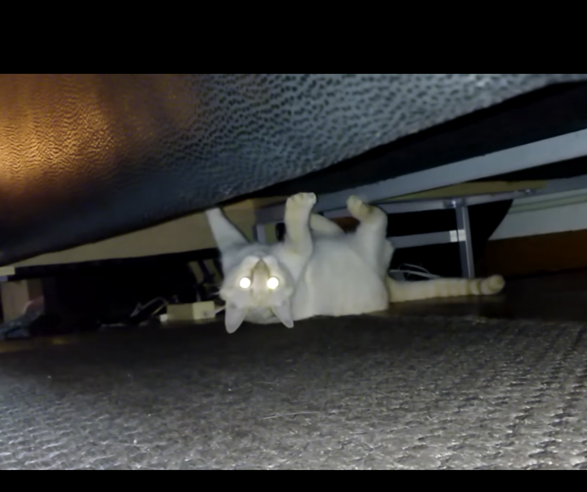
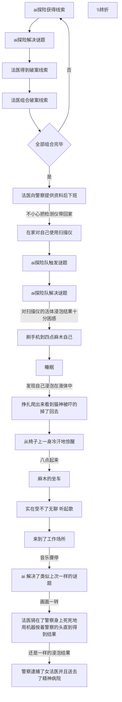
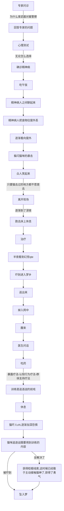
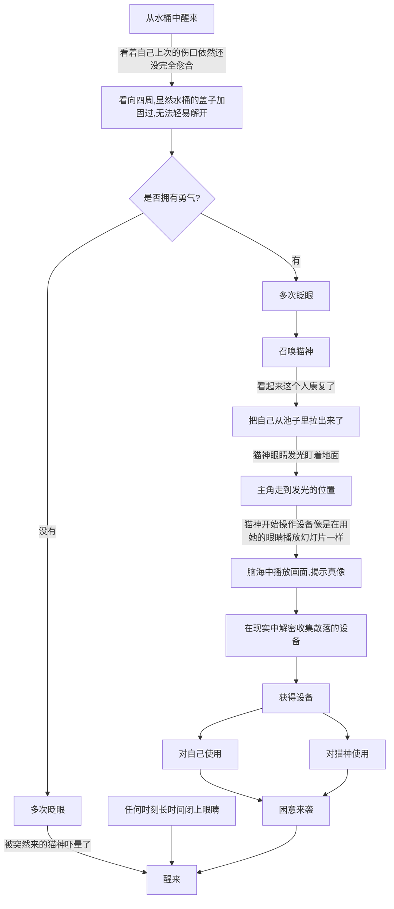
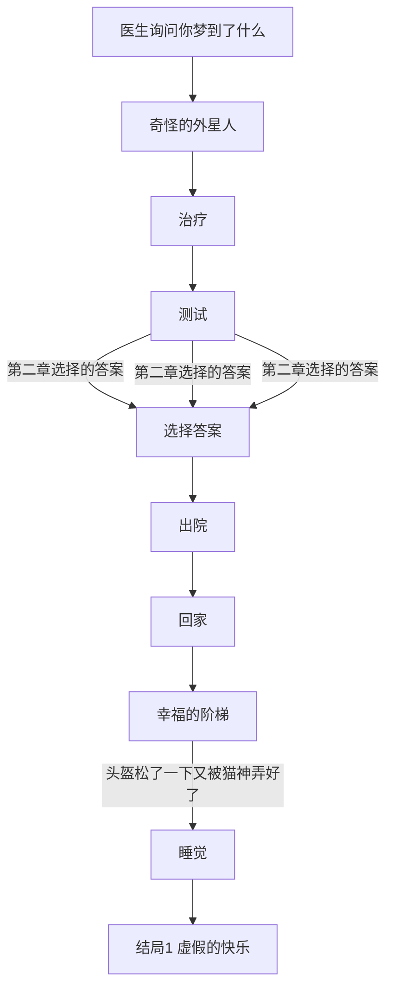
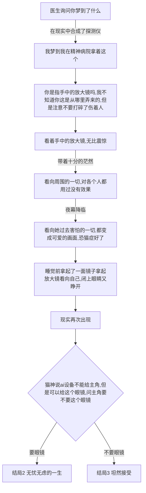

# 游戏剧情

## 世界观

一个外星人误入的世界，主角要在梦境与现实中寻找真相。

**剧透警告！！**
在日常的一天，突然流星坠落，砸到了真央（主角）的家中，在睡梦中惊醒的真央，看到父母被压倒在瓦砾下，
房间屋顶已经倒塌了一半，上面有着陌生的飞行器，由于睡美人症主角再次昏睡了过去，飞行器中下来了几个外星人，它们并没有恶意，此次是紧急迫降导致的事故，为了弥补主角一家人，对主角一家人进行了治疗，将受伤的他们放入了有治疗功效的桶中，主角在梦中

### 相关设定

- 真央（我）：得了睡美人症的女大学生，与父母一同住在公寓中，总是逃避凡事想着靠别人解决，胆怯，，宅女形象，十分害怕猫。
- 女法医（我）：梦境中由于我对真相的渴望，成为了法医，工作疲惫，有黑眼圈；
- 父亲的尸体 ：梦境中象征着真央父亲的尸体，50来岁；
- 母亲的尸体 ：梦境中象征着真央母亲的尸体，50来岁；
- 男探险员（我）：梦境中我认为的 ai 工具中的其中一个人格，深色短发带着鸭舌帽，双肩包；
- 男探险员2号：梦境中我认为的尸体 a，看起来就像父亲年轻时的样子；
- 警察1号：梦境中女法医的男同事，看不到脸，只能看到制服和背影；
- 猫神：拥有高科技的外星人，能够通过改变自身的折射率让他人看到不同的样貌，默认选择了猫头人身的形象,外貌看上
去很有野性；
- 通过眼镜看到的猫神：看起来就像是一个野性十足猫耳大姐；
- 精神病医生：女医生，看着像是通过眼镜看到的猫神，只不过没有猫耳，这个人是现实生活中猫神的隐射，总是希望主角能忘掉猫神的存在;
- 精神病患者a：看不到脸;
- 精神病患者b：看不到脸;
- 精神病患者c：看不到脸;

### 恐怖的画面

1.猫在床头打人。

2.猫一直在身后，只要回头就能看到。

3.手脚伸出去床边就会被猫打。

4.把头弯下去看床底，结果看到上下颠倒的猫。

5.错误的认知。

6.半夜路上栏杆处传来视线

### 如何意识到哪边是梦境

1.在现实中跌倒留下了伤口，随着日子过去逐渐愈合，真实到离谱。

2.先是在现实中探索发现了外星人的痕迹，然后发现能够抱着 ai 检测仪到梦境，而梦境中却不能带着发夹回去。

## 游戏玩法

1.通过选项改变游戏的走向,梦境中主角信以为真的东西将会在梦境中变成真的，而认为是假的东西将会变成假的。

2.组合道具破解谜题

3.通过按着鼠标躲避/挑逗猫咪，达成不同的心理成就，但是只要松开按键就认为是失败

4.遭遇战（高潮部分），只有通过一系列操作顺利地战胜梦境中恐惧，才能获取获取

### 第一章 破案

暗线：
女法医对死去的一男一女都无法解释死亡的原因，抓狂了，其实意识死去的一男一女对应着的是现实生活中的父母，一直无法理解父母死亡\昏迷的原因，在浸泡桶里面幻想自己的身份是女法医。

### 第二章 治疗

暗线:
现实生活中，科技已经很发达了，但是没有 ai 设备，那个设备来自猫星，之所以在梦境中出现是因为主角在出事故的时候瞧见了猫星人使用这个设备，猫星人对沉睡中的主角进行了精神干预企图让主角失去关于外星人相关的记忆，在梦境中的体现是治疗。

### 第三章 现实

#### 分支1

#### 分支2

## 结局

### 不愿醒来 无知 虚假的快乐

达成条件：完全按照梦境中的常人的逻辑直到出院,没有发现自己的睡美人症状。
在梦境中出院了，但是认为自己一切现实都是梦，猫神没办法，给主角套上了虚拟现实的设备，在梦境中主角坐上了世界最长的自动扶梯，其实是被收入了飞船中，画面处处闪过现实和梦境，主角过上了虚拟美好的一生，哪怕察觉到生活中的某种不对劲的地方也不愿揭穿自己。

### 无忧无虑的一生 接受了猫神的赔偿

达成条件：不再逃避，清醒时面对猫神的对峙，选择了获得眼镜道具
主角醒来了，睡美人也痊愈了但是带上了眼镜，一切事物看起来都是美好并且符合常识，当上了最厉害的猫科医生。

### 坦然接受

达成条件：不再逃避，清醒时面对猫神的对峙，选择了接受现实。
主角醒来了，睡美人也痊愈了，只是猫神也把记忆给消除了，只能隐隐约约地看到路边的猫在对自己笑，现实生活只能靠自己了
