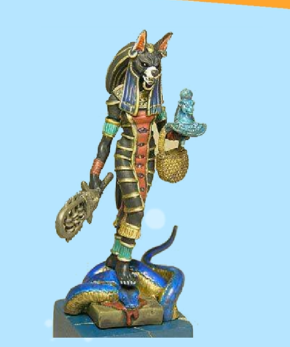
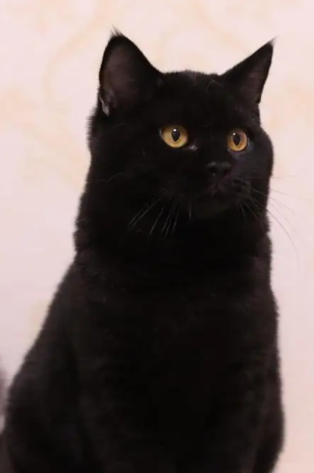
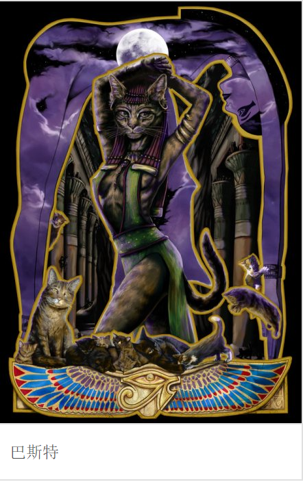
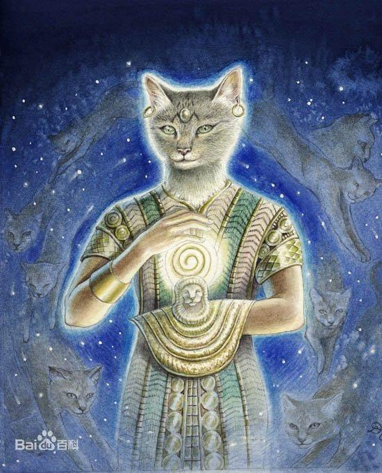
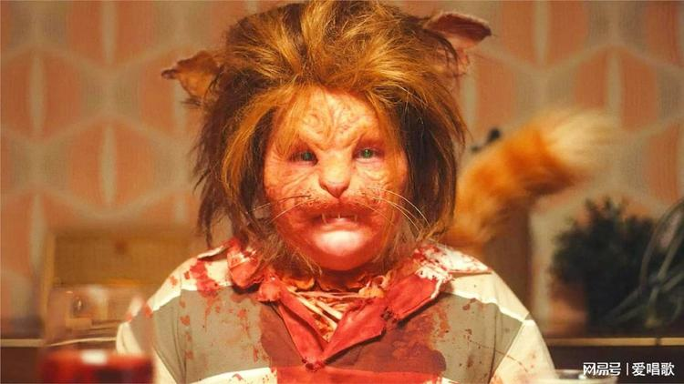
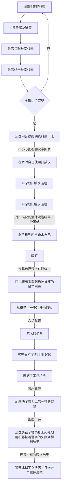
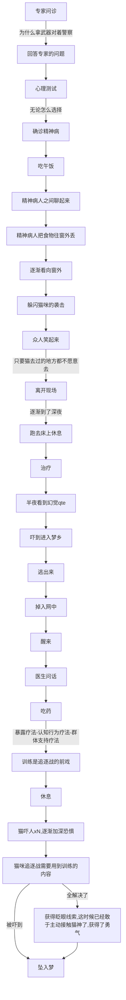
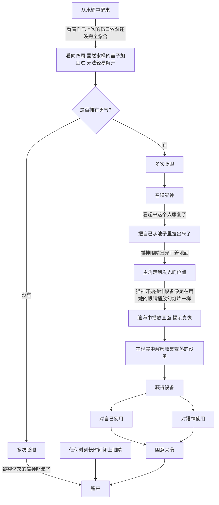
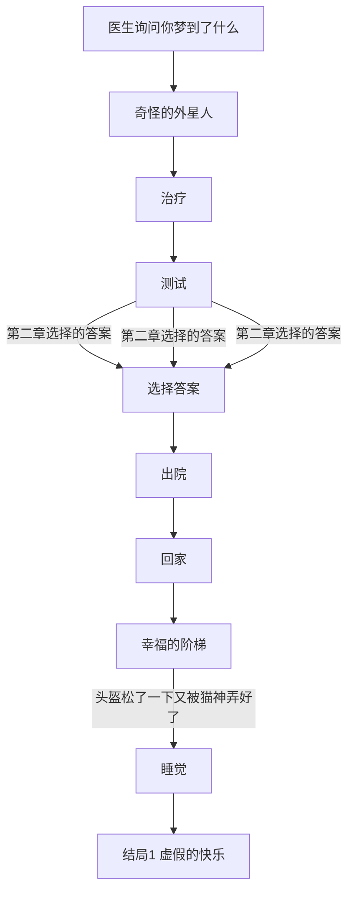
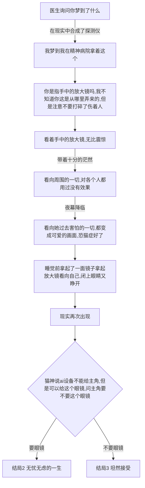

# 游戏剧情

## 世界观

一个外星人误入的世界，主角要在梦境与现实中寻找真相。

**剧透警告！！**
在日常的一天，突然流星坠落，砸到了真央（主角）的家中，在睡梦中惊醒的真央，看到父母被压倒在瓦砾下，
房间屋顶已经倒塌了一半，上面有着陌生的飞行器，由于睡美人症主角再次昏睡了过去，飞行器中下来了几个外星人，它们并没有恶意，此次是紧急迫降导致的事故，为了弥补主角一家人，对主角一家人进行了治疗，将受伤的他们放入了有治疗功效的桶中，主角在梦中
进行着鬼怪异样的生活。

### 相关设定

- 真央（我）：得了睡美人症的女大学生，与父母一同住在公寓中，总是逃避凡事想着靠别人解决，胆怯，宅女形象，自责，十分害怕猫，没带眼镜。
- 女法医（我）：梦境中由于我对真相的渴望，成为了法医，工作疲惫，有黑眼圈；
- 父亲的尸体 ：梦境中象征着真央父亲的尸体，50来岁；
- 母亲的尸体 ：梦境中象征着真央母亲的尸体，50来岁；
- 男探险员（我）：梦境中我认为的 ai 工具中的其中一个人格，深色短发带着鸭舌帽，双肩包；
- 男探险员2号：梦境中我认为的尸体 a，看起来就像父亲年轻时的样子；
- 法医1号：梦境中女法医的男同事，看不到脸，只能看到制服和背影；
- 猫神：拥有高科技的外星人，能够通过改变自身的折射率让他人看到不同的样貌，默认选择了猫头人身的形象,外貌看上去很有野性，黑色的毛发,外观很有赛博朋克的科技感，眼睛会发光,个性随和开朗，亦有沉稳强势的一面，但偶尔会做出戏弄他人的举动,
看起来是黑短品种的猫咪，拥有人的身形，直立行走，但是手脚都是猫的；
对于猫神来说说就是想想就是说，说就是想，因为它们是直接用光信号交流的

- 通过眼镜看到的猫神：看起来就像是一个野性十足的黑皮银发猫耳大姐，手脚都是人的，与之前的外表比起来显得羞涩的许多，盯久了会害羞，此时能看出来真实的内在其实是个很可爱的女孩子；
- 精神病医生：女医生，看着像是通过眼镜看到的猫神，只不过没有猫耳，这个人是现实生活中猫神的隐射，总是希望主角能忘掉猫神的存在;
- 精神病患者a：看不到脸;
- 精神病患者b：看不到脸;
- 精神病患者c：看不到脸;

### 恐怖的画面

1.猫在床头打人。

2.猫一直在身后，只要回头就能看到。

3.手脚伸出去床边就会被猫打。

4.把头弯下去看床底，结果看到上下颠倒的猫。

5.错误的认知,有时看到扭曲事实，特别是害怕猫的时候看起来猫十分骇人。

6.半夜路上栏杆处传来视线

### 如何意识到哪边是梦境

1.在现实中跌倒留下了伤口，随着日子过去逐渐愈合，真实到离谱。

2.先是在现实中探索发现了外星人的痕迹，然后发现能够抱着 ai 检测仪到梦境，而梦境中却不能带着发夹回去。

## 游戏玩法

1.通过选项改变游戏的走向,梦境中主角信以为真的东西将会在梦境中变成真的，而认为是假的东西将会变成假的。

2.组合道具破解谜题

3.通过按着鼠标躲避/挑逗猫咪，达成不同的心理成就，但是只要松开按键就认为是失败

4.遭遇战（高潮部分），只有通过一系列操作顺利地战胜梦境中恐惧，才能获取获取

### 第一章 破案

暗线：
女法医对死去的一男一女都无法解释死亡的原因，抓狂了，其实意识死去的一男一女对应着的是现实生活中的父母，一直无法理解父母死亡\昏迷的原因，在浸泡桶里面幻想自己的身份是女法医。

四处传来奇怪的视线，
天黑，丛林传来蜘蛛的视线（八只眼睛），//暗示这里有蜘蛛
一个男人跑过，// 教程，点击屏幕移动
女人
下起了大雨，我为了避雨跑进了一个洞窟中（洞窟上有蜘蛛网），// 暴雨意味着悲痛的心情，洞窟又意味着心里的漏洞，又再次暗示有蜘蛛

两人相视了许久，久久不能发言
法医说了一句，他曾今抽烟，但是戒了（只有声音、文字）。

洞窟中漆黑一片，男的拿出了打火机和火把，
看着肆意生长的藤蔓，他们马上明白想要进入此处就要燃烧这个藤蔓。// 新手教学，高亮火把和藤蔓，这意味着死灰复燃，不再隐藏感情
女的喊道，“小心点，不要烧坏了这里的东西。”
男的冷笑着回答，“这是一座空荡荡的山洞，有什么东西需要珍惜的？”
男的不以为意地耸了耸肩。//这是收集物品的教程
男子觉得渴了，去寻找地下水
男子去收集水了。当他回来时，女的拨开了地上的灰正在仔细地观察着墙壁刻着的奇怪符号。
“你知道这是什么吗？”女的问道。//提起往事

男的看了看石桌，摇了摇头，“我不知道，也许只是些古老的符号。”//不愿提起过往
男子装起山泉水起来，
两个人一个人拿着保温杯盖另一个人拿着保温杯，碰起被子来，响起了清脆的声音
女子：“谢谢”
两人都喝起水来。
法医说了一句，他昨天喝酒了。（只有声音、文字）
男子：“天气冷了，点燃篝火后休息吧，明天我还得赶路呢。”//明天就要离开这个女人了
男子和女子纷纷拿起了睡袋，
进入了睡眠//睡眠教程，长按闭眼睡觉
半夜啜泣声响起
女子：“呜呜呜 ，为什么你装作什么都不知道。”。
女子：“我好害怕 ，我好饿。”。
男子刚想伸手安慰，结果发现自己的睡袋已经变成了蜘蛛网，手脚无法动弹。
男子目瞪口呆。
女子：“我不想再一个人，和我一直在一起吧”
男子最终看到的是女子的蜘蛛大口。

“查出死因了吗？”，一个年轻的法医站在房间门口问道。
// 男的一开始就是很熟悉这个女的，一眼就认出来了，只是装作不认识
// 男的出轨了，偶遇了前女友，但是前女友发现了自己的纹身被白色郁金香盖住了

画面一闪，又看向解剖室
“快了”，说罢，我再次拿起记忆扫描仪，“滴滴”声再次响起。
“这个人胸口同一处纹了两次身，第一次是人的名字，第二次是白色的郁金香，意味着告别，应该是对上次恋爱的告别吧”。
“快点吧，法院那边还等着你出报告呢。”同事说道。
人影散去，只听同事小声嘟囔了一句“这个人整天神神叨叨的，到底行不行啊。”。
听到了同事的刁难，等完全听不到脚步声后我才低下了头，“真是十分抱歉”。 // 避免与他人接触
我抱着头，一阵头疼袭来，紧接着
再次将设备靠近尸体，得到了尸检结果。
在整理完所有报告后，已经是晚上六点了。
心烦意乱地将桌上的物品都放入自己的包中。
出来工作半年了，接近转正的时间了，工作总是特别累，每当我完成一起案件时，前辈马上就会给我安排下一起案件，别人半个小时完成的案件，而我需要花一个半小时。// 工作效率下降
压抑地在更衣室吃完饭后回到家里。// 点了两个汉堡，暴饮暴食是食欲改变的体现
浴室里主角由于身上会沾上味道，反复清洗了多边，即使明天可能也会沾上味道。
回到家后，洗完澡的主角，准备从包里拿出手机，
此时才发现，之前不小心把 ai 设备带回去了。
身心疲惫的真央，无聊的把玩这个设备。
此时玩家只有一个行为，就是对自己使用 Ai 设备。
画面一转
先是看到一片黑暗，
有荧光在到处飘动// 父母用微弱的手电筒短暂逗婴儿
跟着走走着走着发现动弹不得，
低下头一开发现自己一只腿被透明的管道缠绕了。
才发现自己穿着宇航员的头盔，
被一个未知的力场包裹着，
这个力场里面全是淡蓝色色的水// 羊水
拍打和踢都对这个力场无效。
“unbirth”,看着这个 ai 设备，主角陷入了沉思，
明明自己已经活了26年，为什么这个设备说我未出生。
这时多个选项

- 这个设备一定是出了故障吧？不可能我从未出生！ // 不信
- 我是谁？我到底是不是人？如果我从未出生，那我存在的意义是什么？ // 恐惧和绝望
- 果然我从未出生，不然父母也不会离开我// 愧疚
- 这个结果一定是有误的，我必须找到更多的证据来证明我的存在！我要了解更多关于我自己的信息！// 探索和求证
- 既然我从未出生，那么这里的一切都是假的// 自我颠覆
- 我不想再想下去了

手机闪过一堆短视频，无力的点着屏幕，玩家可以点屏幕，一直点击屏幕直到时间变成三点，

随着点击的次数变多，黑眼圈也逐渐变浓，脸红，瞳孔也逐渐变成爱心的形状,画面越来越荒诞，出现闪烁的人物描边。
// 参考这个[手书](https://www.bilibili.com/video/BV1Lf4y1N7f8/?share_source=copy_web&vd_source=5aac9ec6cd325617065a2bc0b0e62572)
正躺着尝试入眠的时候突然心痛，（屏幕抖了一下）捂住心脏。
先是慌张了一下，又觉得好笑，因为大量冷汗包裹着我仿佛现在就像是掉入水了一样。
突然眼前一黑，周围的一切像是吸入了黑洞般扭曲了起来。//细节：包括所有 ui 界面
挥了挥手，传来的感觉，什么？
没有困意但是头有点沉，扭了一下头，自己周围的一切都是陌生的
仿佛自己像是穿越了一样，
 // 第一次醒来，之前一直沉睡
发现自己身处的环境很奇怪，自己是没有动的，而所有景色都在旋转，而且不受重力影响。
“我... 是在...梦吗”
不开口还好，
一开口一阵违和感上来
自己的声音仿佛被加了过滤器一样低沉。
原来我梦到自己变成男生了吗。
眼前漆黑一片几乎没有光源,只有淡淡的蓝色环境光 // 某种杀菌用的射线
看到的一个垂向右侧的像是金属吊床的东西。
// 朝上头看去看到的像是墙壁，
// 背景右侧看到了各式各样贴在右边的头盔，扫描仪，
突然，听到了普鲁普鲁的气泡声从左侧传来，
就见到从左侧的管道处出现多个来回跳动的透明的小球正在朝自己靠近，
但是过了一会小球突然消失了，
才意识到自己原来自己之前见过这个景象，
小时候自己养过鱼，这是给鱼打气用的，我在水里。
扑哧一声笑了起来，
"啊哈哈哈，那我就是鱼咯"。
心想这个梦是真的有趣啊好久没做梦了。
想试试看吐出一个泡泡，
发现，自己这么做只是激起了一小段水流。
突然发现自己已经很久没有呼吸了，
自己肺部充满着液体，
拍了一下自己的脸后，确认了一下没有鱼鳃。
不行啊这样我会呛死的，一定是现实中我又不小心把被子盖住了自己的脸。
只要我做出掀开被子的动作，在现实中一定会有什么效果这样才不会窒息。
这么想着我连续做了几次这样的动作，过不了多久我就能再次喘气了// 玩家点击屏幕将向右移动屏幕,逐渐看到一些仪器和发光的文字，文字是水平翻转的 UNBIRTH 和整个游戏的剧情文字画面，很显然是给外面的人看的。
“砰”
传来一整痛感，这是第一次在做梦的时候体验到了头撞到墙的感觉，
还没来得及捂住头部，痛得眨了下眼 // 逃避和自我防卫的行为
睁开眼伸手摸了摸头上面的东西，像是一个圆柱形的白色金属。
“普鲁普鲁”
又一段水波荡漾了起来，还是不行，为什么，明明我都已经掀开被子了才对。
难不成我是真的掉水里了？
突然在金属吊床上有两个聚光灯亮了起来。
那盏灯在四处扫描着，// 响起 18bit 的激光声音
直到聚光灯扫到我这边我才看到了那东西的长相，
那是一只黑猫，像是抬起头将嘴巴恶狠狠地咧开，瞳孔张的十分大，// 其实是在打哈切
我吓得浑身抖擞，颤栗了起来，从小到大我最害怕猫，有一次半夜听到婴儿的哭泣声，
后来发现那是猫在叫，然后走在路上被突然猫扑过来

### 第二章 治疗

暗线:
现实生活中，科技已经很发达了，但是没有 ai 设备，那个设备来自猫星，之所以在梦境中出现是因为主角在出事故的时候瞧见了猫星人使用这个设备，猫星人对沉睡中的主角进行了精神干预企图让主角失去关于外星人相关的记忆，在梦境中的体现是治疗。

### 第三章 现实

#### 分支1

#### 分支2

## 结局

### 不愿醒来 无知 虚假的快乐

达成条件：完全按照梦境中的常人的逻辑直到出院,没有发现自己的睡美人症状。
在梦境中出院了，但是认为自己一切现实都是梦，猫神没办法，给主角套上了虚拟现实的设备，在梦境中主角坐上了世界最长的自动扶梯，其实是被收入了飞船中，画面处处闪过现实和梦境，主角过上了虚拟美好的一生，哪怕察觉到生活中的某种不对劲的地方也不愿揭穿自己。

1.耳机明明都拿下来了怎么音乐还在播放，管它呢，兴许是耳机坏了。

### 无忧无虑的一生 接受了猫神的赔偿

达成条件：不再逃避，清醒时面对猫神的对峙，选择了获得眼镜道具
主角醒来了，睡美人也痊愈了但是带上了眼镜，一切事物看起来都是美好并且符合常识，当上了最厉害的猫科医生。

### 坦然接受

达成条件：不再逃避，清醒时面对猫神的对峙，选择了接受现实。
主角醒来了，睡美人也痊愈了，只是猫神也把记忆给消除了，只能隐隐约约地看到路边的猫在对自己笑，现实生活只能靠自己了
