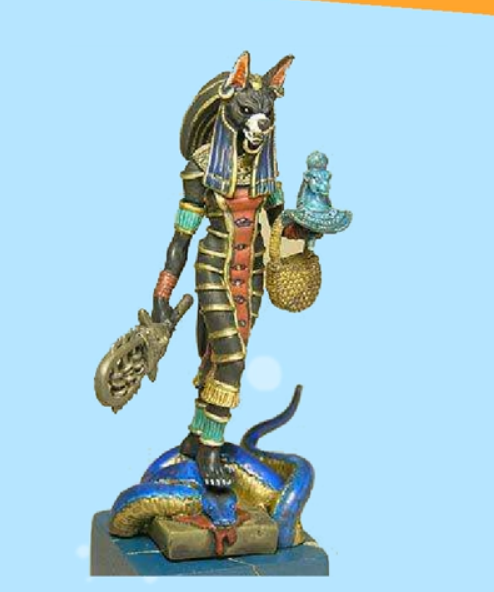
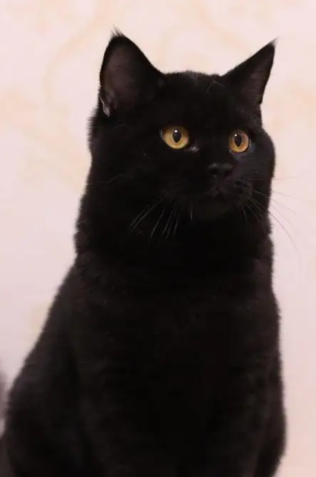
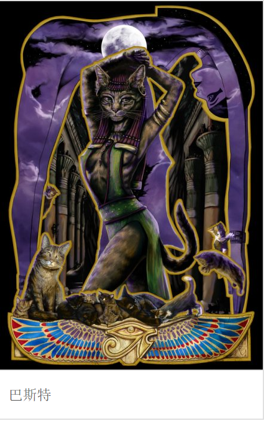
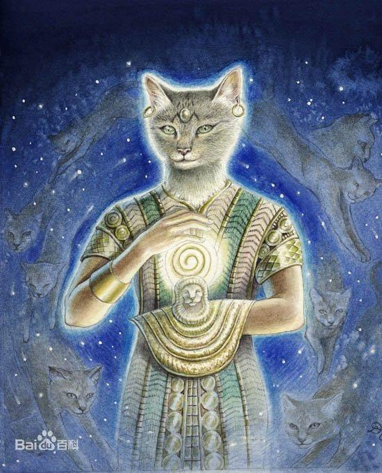
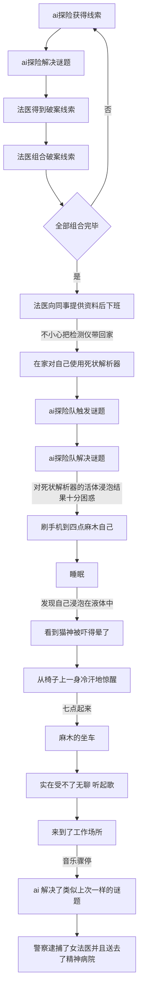
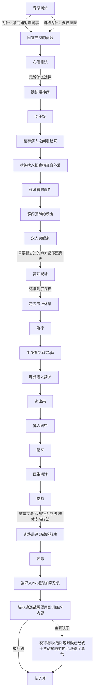
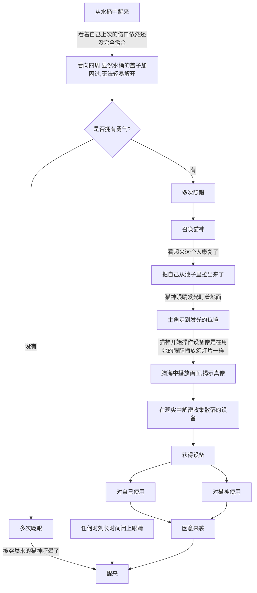
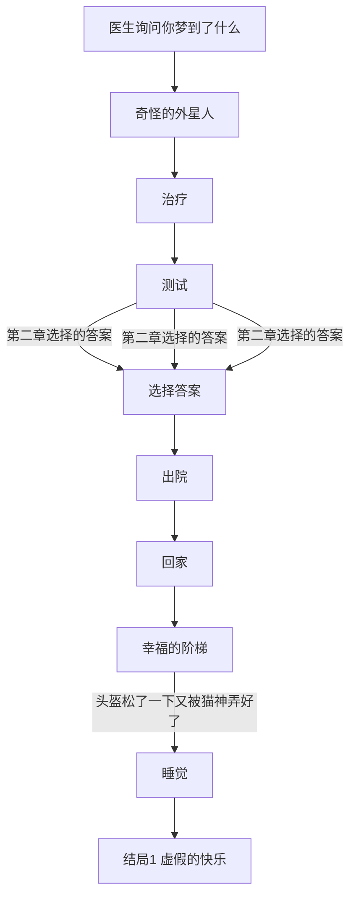
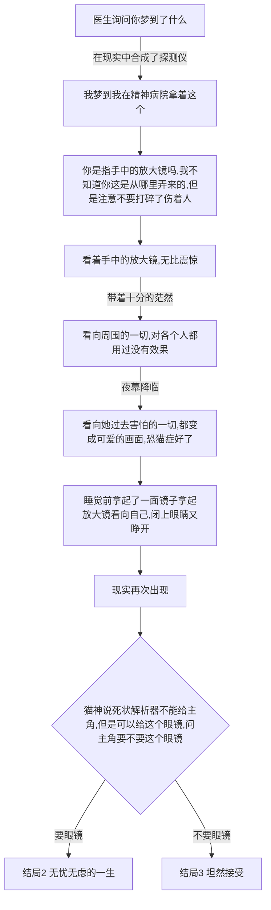

# 游戏剧情

## 演出稿

- [1-1](./%E6%BC%94%E5%87%BA%E7%A8%BF/%E5%8F%A4%E4%BB%A3%E6%95%85%E4%BA%8B/readme.md)
- [1-2](./%E6%BC%94%E5%87%BA%E7%A8%BF/%E7%94%A8%20ai%20%E8%AE%BE%E5%A4%87%E7%9A%84%E9%AB%98%E7%A7%91%E6%8A%80%E8%A7%A3%E5%89%96/readme.md)
- [1-3](./%E6%BC%94%E5%87%BA%E7%A8%BF/%E4%B8%8B%E7%8F%AD%E5%9B%9E%E5%AE%B6/readme.md)
- [1-4](./%E6%BC%94%E5%87%BA%E7%A8%BF/ai%20%E8%AE%BE%E5%A4%87%E7%85%A7%E5%B0%84%E5%90%8E%E7%9A%84%E6%A2%A6%E5%A2%83/readme.md)
- [1-5](./%E6%BC%94%E5%87%BA%E7%A8%BF/%E7%8C%9D%E6%AD%BB%E5%90%8E%E7%9A%84%E5%99%A9%E6%A2%A6/readme.md)
- [1-6](./%E6%BC%94%E5%87%BA%E7%A8%BF/%E7%A6%BB%E5%BC%80%E5%AE%B6%E4%B8%8A%E7%8F%AD/readme.md)
- [1-7](./%E6%BC%94%E5%87%BA%E7%A8%BF/%E8%A3%81%E5%91%98%E4%B8%8E%E7%99%AB%E7%8B%82%E7%9A%84%E6%8A%A5%E5%91%8A/readme.md)

## 世界观

一个外星人误入的世界，主角要在梦境与现实中寻找真相。

**剧透警告！！**
在日常的一天，突然流星坠落，砸到了真央（主角）的家中，在睡梦中惊醒的真央，看到父母被压倒在瓦砾下，
房间屋顶已经倒塌了一半，上面有着陌生的飞行器，由于睡美人症主角再次昏睡了过去，飞行器中下来了几个外星人，它们并没有恶意，此次是紧急迫降导致的事故，为了弥补主角一家人，对主角一家人进行了治疗，将受伤的他们放入了有治疗功效的治疗仓中，主角在梦中
进行着异样的生活。

### 相关设定

- 真央（我）：得了睡美人症的女大学生，与父母一同住在公寓中，总是逃避凡事想着靠别人解决，胆怯，宅女形象，自责，十分害怕猫，没带眼镜。
- 女法医（我）：梦境中由于我对真相的渴望，成为了法医，工作疲惫，有黑眼圈；
- 父亲的尸体 ：梦境中象征着真央父亲的尸体，50来岁；
- 母亲的尸体 ：梦境中象征着真央母亲的尸体，50来岁；
- 男探险员（我）：梦境中我认为的死状解析器中的其中一个人格，深色短发带着鸭舌帽，双肩包；
- 男探险员2号：梦境中我认为的尸体 a，看起来就像父亲年轻时的样子；
- 法医1号：梦境中女法医的男同事，看不到脸，只能看到制服和背影；
- 猫神：拥有高科技的外星人，能够通过改变自身的折射率让他人看到不同的样貌，默认选择了猫头人身的形象,外貌看上去很有野性，黑色的毛发,外观很有赛博朋克的科技感，眼睛会发光,个性随和开朗，亦有沉稳强势的一面，但偶尔会做出戏弄他人的举动,
看起来是黑短品种的猫咪，拥有人的身形，直立行走，但是手脚都是猫的；
对于猫神来说说就是想想就是说，说就是想，因为它们是直接用眼睛发出的光信号交流的，同样的它们也拥有一些设备能够直接将思维直接投影成它们能理解的光信号。

- 通过眼镜看到的猫神：看起来就像是一个野性十足的黑皮银发猫耳大姐，手脚都是人的，与之前的外表比起来显得羞涩的许多，盯久了会害羞，此时能看出来真实的内在其实是个很可爱的女孩子；
- 精神病医生：女医生，看着像是通过眼镜看到的猫神，只不过没有猫耳，这个人是主角的逃避的具象化，总是希望主角能忘掉猫神的存在，
离开所有压力源，和主角说父母还在并且让他们之间见面和电话;
- 外神：能够操纵人类思维，操作时间的高维生物，猫神在部分结局的时候能够感知这类生物的投影，并且直接通过投影与外神直接交流，
其实这个外神就是玩家。
- 梦中的父亲：见不到脸；
- 梦中的母亲：看不到脸；

精神病人以及他们的病因和解决方案

- 精神病患者b（初出茅庐的打工人）：
现象：抑郁症

原因：长期不满足自己的期望可能会导致情绪低落、失去兴趣和乐趣等抑郁症状，特别是当个人认为自己无法改变现状时，一直无法满足自己过高的学业期待和收入。

因为他周围的人总是期待别人，不够了解别人的时候，就胡乱期待，不从实际出发的期待。

解决方案：

识别和记录不合理的思维模式：例如，“我不可能完成这项任务，我不够聪明/能干/有经验”。

挑战这些不合理的思维模式：例如，“这些想法并不客观，我曾经完成过类似的任务，我有能力学习和成长”。

制定具体的计划和目标：例如，为完成这项任务制定一个清晰的计划和时间表，分解任务为小步骤，逐一完成。

实践新的行为和思维模式：例如，积极面对任务，行动起来，并记录自己的进展和成就，逐渐建立起积极的自信心和行动习惯。

抽象后的玩法：把恐怖的画面当成音乐节奏类小游戏，收集音符，根据提示按下音符创造音乐，

现实中：在学习吉他音乐。

游戏细节：会在伪结局即使没戴耳机，也会听到自己弹奏的 bgm,哪怕是玩家乱弹的也记录了下来作为 bgm

- 精神病患者a(小孩子)：
现象：交流障碍

原因：因为小时候犯了一些小错，就会被严厉的教训和呵斥，导致了支支吾吾，无法组织语言，说话慢慢吞吞，慢半拍。

解决方案：与其他交流障碍的小孩子一起学习外来语种，并且只要组成简单的句子，立马鼓励，逐渐的由于正向的激励下，逐渐自信，能够正常的交流了。

抽象后的玩法：学习外星人的语言，与外星人对话，满足外星人的需求，获得外星人的祝福。

现实中：实际上是在潜意识中和猫神学习外星语言，只有实现这一步，猫神才能理解人类的语言。

游戏细节：在修复交流障碍之前所有与人对话选项全是错的，然后主角会自言自语说，我得先学会说话。

- 精神病患者c：

现象：ptsd，害怕猫,噩梦和闪回，避免走有排水口的路，避免出现在有猫的地方。

原因：有一次小学的时候半夜听到婴儿的哭泣声，

好奇心驱使下我走到楼下去寻找声音的来源，

后续声音发现在路边缘的下的排水口传出，

将头埋进排水口，看到一群猫扭曲在一团，

其中一个猫还从下面凌空飞起两米，企图抓我的眼睛，

然后顺着声音走过去走在路上被突然两只猫扑过来，还一边斗殴，

吓得我一边哭一边跑，从此得了 ptsd。

解决方案：

首先，治疗师可能会请患者描述他们所害怕的猫科动物的场景，并提供一些关于这些动物的知识，以便减轻他们的恐惧感。

然后，治疗师会逐步暴露患者于这些猫科动物的刺激，例如观看猫科动物的照片或视频，逐渐适应它们的形象。

当患者感到舒适后，治疗师可能会引入更多挑战性的刺激，例如向患者展示真实的猫科动物，但仍然在安全距离内。

最后，当患者逐渐适应这些刺激并对它们不再感到害怕时，治疗师可以逐渐增加暴露刺激的强度和难度，例如患者可以试着触摸或与动物互动。

抽象后的玩法：在精神病院中找到所有的猫，并且还得判断出所有猫的需求，看着非常小儿科，故意做的，噩梦和闪回远远不断，但是医生认为已经治愈了，起码敢去猫走过的地方了。

现实中：猫神在减轻主角对猫神的恐惧

游戏细节：在治愈之前晚上和平时会闪回被猫吓的记忆连猫去过的地方和下水道都不愿意去，而治疗后敢去这些地方，而闪回的内容却变了

extra: 在最后的时候追逐战是由于主动找医生说觉得自己还没有好才会触发，触发后医生会催眠，让自己唤起记忆，这时候抽象的玩法是追逐战，需要完美通过这个追逐战才能最终获得勇气，否则就会失败。

### 恐怖的画面

1.猫在床头打人。

2.猫一直在身后，只要回头就能看到。

3.手脚伸出去床边就会被猫打。

4.把头弯下去看床底，结果看到上下颠倒的猫。

5.错误的认知,有时看到扭曲事实，特别是害怕猫的时候看起来猫十分骇人。

6.半夜路上栏杆处传来视线

### 如何意识到哪边是梦境

1.在现实中跌倒留下了伤口，随着日子过去逐渐愈合，真实到离谱。

2.先是在现实中探索发现了外星人的痕迹，然后发现能够抱着死状解析器到梦境，而梦境中却不能带着发夹回去。

3.梦境中有可以行走和解密的冒险，而现实没有这么有趣，仅仅只有 galgame 那样的对白和选项影响剧情。

## 游戏玩法

1.通过选项改变游戏的走向,梦境中主角信以为真的东西将会在梦境中变成真的，而认为是假的东西将会变成假的。

2.组合道具破解谜题

3.通过按着鼠标躲避/挑逗猫咪，达成不同的心理成就，但是只要松开按键就认为是失败

4.遭遇战（高潮部分），只有通过一系列操作顺利地战胜梦境中恐惧，才能获取获取

## 环境

- 主角房间
垃圾堆，

- 治疗室

- 工作房

- 更衣室

### 第一章 破案

<!-- 隐藏的细节：
女法医对死去的一男一女都无法解释死亡的原因，抓狂了，其实意识死去的一男一女对应着的是现实生活中的父母，一直无法理解父母死亡\昏迷的原因，在浸泡桶里面幻想自己的身份是女法医。 -->
剧情：

玩家此时扮演一个上山采药的男子。

男子：“天啊，得找个地方躲雨。”，男子跑起来。

恰巧，他在山深处遇到了一个风尘女子，她正被雨淋得狼狈不堪。

突然听多一处脚步声，回头望去看到一个女子正跟着自己。

男子便将她带往附近的一个山洞，然而洞口被一团长满白色花朵的藤蔓阻挡。

男子：“姑娘为何这个时辰还在深山老林徘徊？”

女子气喘吁吁，双唇发白，瑟瑟发抖，看起来没有力气回答他，也不知道是不是刚从青楼逃出来。

男子：“这样下去不行啊，这女子要晕倒过去了，得赶紧帮帮她”

当看向洞穴被白色花朵的藤蔓遮挡，

真央说：“白色郁金香的纹身......花语是......告别。”

男子掏出行囊的刀，砍向了藤蔓。

女子急忙说：“慢着，听说这座山上有地方封印着妖怪，这些藤蔓可能是某种封印。”

男子：“姑娘，顾不得那些故事了，看着这些藤蔓能够生火，我砍下进入山洞。”

真央说：“看起来他曾是个烟鬼，后来戒了，嗯，不过他在当晚抽了几根烟。”

谁知再次砍出一些裂缝，一阵妖风吹过，藤蔓突然自燃。

两人走进洞穴，发现洞穴内有明显的生活痕迹，一个熄灭的篝火，一堆木材，还有清澈的泉水。

男子：“你看起来又冷又口渴，来，我给你装点泉水。”他用瓢装了水给女子，

然后用木材重新点燃了篝火。

女子接过瓢里的水，看着像是爬山涉水许久很累的样子还没有力气说话。

真央说：“他当天喝酒了。”

男子将木材放入篝火，用火折子点燃木材，火焰跃然而起，女子有些感动说：“谢谢。”

男子：“姑娘为何出现深山中？”

女子眨了眨眼，嘴角带着困惑：“我……我也不清楚，只记得走着走着，就走到了这里。”

男子：“那你家在哪？有没有人在找你？”

女子：“我……我……我不记得了。”

男子：“姑娘，外面一时半会雨也不会停，安全起见，先在此山洞凑合一晚，明天再带你回我的村里想想办法。”

说罢，男子将石凳上的兽皮铺在一边，女子躺了上去，男子靠着自己的行囊休息。

困意来袭，画面逐渐变暗。

到了半夜时，女子突然睁开眼睛，眼神已经不再是原来那个女子，而是妖怪的眼神。

蜘蛛精看着男子，目光中闪烁着复杂的情绪，“相公...醒醒，是我啊。”

蜘蛛精：“相公你说过愿意来世再续前缘的，我一直在等你啊。”

蜘蛛精：“现在你终于来找我了，我好开心啊”

男子睡眼惺忪地说：“姑娘你在说什么，我才刚认识你，怎么就成你相公了呢？”

蜘蛛精：“相公，这是我们之前的故事，你还记得吗？”

蜘蛛精用手指向洞壁，墙壁浮现出上一连串鲜红色的绘画，这是蜘蛛精上辈子刻在墙上的，对过去生活的记录。

（有点埃及画的感觉的的一系列故事，大致讲述的是女性第一视角看到打仗的时候男的不愿屠村，救下敌方的一家当逃兵和女躲避战乱，来到洞穴中生活，其乐融融，但是男的最终还是在山上被国家发现，并且被拖走了再也没回来）

在玩家看到这画的时候，真央说：“他曾经在胸口纹了一个女性的名字。”

男子感到一阵恐慌，他从未感觉过如此强烈的恐惧。他的心跳加速，冷汗直流，他开始呼吸急促，头一涨一涨的。

蜘蛛精正想和男子讲述这个故事，谁知这个男的已经抛弃了行李跑到山洞门口了，

可蜘蛛精哪会就这样放他走掉，蜘蛛丝缠住了男子的手，将男子缠绕到蜘蛛精附近。

男子像个蠕动的虫子一样像蜘蛛精磕头。

男子：“大仙，饶了我吧，小的我上有老下有少，妻儿还在山下等我回去呢。”

蜘蛛精：“你说什么？！ 妻儿？”

蜘蛛精眼中的怒火越烧越旺，她手中更多的蛛丝如同有生命般缠绕在男子身上，“如果你不爱我，就去死吧。”

最后，她用力一拉，蛛丝如刀般切入男子的肉体，将他缠绕致死。

蜘蛛精：“我会撕烂你的双翼，咬烂你的嘴唇。” （歌词）

蜘蛛精：“下辈子，下辈子你一定会重新爱我的。”

健司走进房间，手上拿着一份文件，看着坐在一旁的真央说：“真央，你的报告完成了吗？”

真央没有回答，她仍然盯着手中的死状解析器，仿佛没有听到健司的话。她似乎陷入了沉思，低声自言自语：“看来，这个男子的前女友是因为看到他胸口纹身上的白色郁金香，以及他身上的婚戒，才痛下杀手的。这个纹身，曾经是她的名字，但现在却成了象征着告别白色的郁金香。”

健司皱起眉头，稍显不耐烦地说：“真央，你总是自言自语，做事还是那么拖沓，你总是喜欢把事情拖到最后一刻。我不知道你在想什么，你能把注意力放在现实中吗？”

真央没有马上回答，健司露出失望的表情，转身离开了房间。在他的背影消失在门口后，真央才低声说：“我……我会尽快完成报告的。”

真央走出办公室时，她没有意识到自己已经写完了报告，她还以为自己还有很多工作要完成。她心思沉重，完全没有注意到外面的情况。

当她收到来自外卖到了的电话，走到门口时，看到了地上有两份外卖，一份是下午叫的，另一份是刚才叫的，她突然意识到自己点了两份外卖。她有些困惑地看着手中的外卖袋，想着自己为什么点了两份。她摇了摇头，把这个问题暂时放在一边，决定先去更衣室再慢慢想。

她把外卖放进包里，准备去更衣室。走到门前，她突然停下脚步，手放在门把上。她皱起眉头，心里有一种奇怪的感觉，仿佛忘记了什么重要的事情，但是又想不起来了。（她把自己的报告不知道放哪里去了）

真央拿出手机看了一眼，屏幕上显示着晚上七点的时间。她吃了一惊，意识到自己已经晚了。她想起了刚才在办公室的沉思和解析器的工作，她的心情变得更加焦虑起来。

在她心中，那份吃完多出来的套餐就像完成工作一样困难，让人无法忍受。每一次咀嚼都像是在咬嚼着工作的压力，尽管味道还算不错，但这份无力感却让她无法享受到其中的乐趣。

她觉得自己好像快要窒息了，每天的生活就像是被无形的枷锁锁住，每一步都步步艰难。

看着手机屏幕上已经是晚上七点的时间，真央心里涌起一股无力感。她无力地想，“我真的可以吃完这两份套餐吗？” 她自嘲地笑了笑，却无法掩盖内心的疲惫。

她想要有人能分担这份餐，就像她想要有人能帮她分担工作的压力一样。但是，事实却是她一个人在办公室里面，面对着这份两人的餐，也像是面对着工作的压力，只能一个人硬撑。

吃完饭，真央觉得自己像是被压垮的骆驼，疲惫得几乎无法动弹。但她知道，这只是暂时的休息，回家后的她，依旧需要面对那堆繁重的报告。

压抑地在更衣室吃完饭后把周围的物品放进包里回家。

真央一边洗头，一边沉浸在沐浴的温暖中。她希望通过洗头的过程，将一天的疲惫和压力洗去。然而，无论她用多少洗发水和热水冲刷，她内心的疲倦却似乎无法彻底散去。

她感到身心俱疲，仿佛所有的力气都被抽干了。她静静地站在浴室里，任由水流不断地冲洗着身体，希望这样能带走一些疲惫和不安。

在冲洗了足足半小时时间后，真央关掉了水龙头，身体湿漉漉地站在浴室中。

洗完澡的真央，准备从包里拿出手机。但是，此时她才发现不小心把死状解析器带回去了。

看着手中熟悉的仪器，

真央心中一阵失望，自言自语道：“怎么把死状解析器带回来了，明天得赶紧还回去。”

要知道一个前提，对医生来说如果将手术刀丢失，将会是导致失职的严重事故，

对于法医来说也是一样，死状解析器如果丢失，将会被辞退并且罚款。

因此这是个十分贵重的物品。

回忆起往事，“家长死于一场未知的意外，当时我还未懂事，只知道再也见不到家人。后来长大后，怀揣着想要知道真相的心情，我成为了一名法医。”

“然而，直到成为法医后，真央才得知家长的遺體丟失了。再也无法得知自己的家人的死因了。”

真央无力地想着：“要是当初有这个仪器，就能够知道家长死亡的真相了。”她感到现在的处境非常无助，即使工作也只是为了填饱肚子。

突然，真央发现自己从来没有对活着的生物使用过这个设备。她思考着：“如果对活着的人使用，会有怎样的反应呢？”

“如果是我的话.....未来会怎么死去呢？”

真央抱着试一试的心态，各种可怕的幻想浮现了出来。

拿起了设备，对准了自己的眉心， 死状解析器中产生了新的故事

当宇航员缓缓苏醒过来，她发现自己身处一个无尽黑暗的空间。这个空间没有地平线，没有星星，也没有任何可辨认的物体。宇航服的灯光微弱地照亮着周围，勉强让她能看清自己身体的轮廓。她感觉宇航服外围有管道紧紧缠绕在身上，就像一条无形的脐带将她与某种未知力量连接在一起。

在飞船的内部，真央感觉自己仿佛置身于一片神秘的深海之中。周围充斥着浓厚的黑暗，宛如无边无际的深渊。她可以感受到水的压力，仿佛被无形的海水所包围。墙壁上覆盖着类似脐带的管道，它们如同神秘的触手般蔓延着，紧贴着飞船的结构，传递着一种奇异的生命力量。

这些管道散发着微弱的蓝色光芒，犹如海洋中的发光生物，点亮了周围一片朦胧的景象。真央可以感受到管道中流动着某种液体，它们在黑暗中悄无声息地流淌着，像是脉络一样连接着整艘飞船。每当她凝视着这些管道，她能感受到一种神秘能量的涌动，仿佛有一股力量在悄然触动着她的灵魂。

除了管道，飞船的内部布满了神秘的符文和符号，它们在黑暗中闪烁着幽蓝的光芒。这些符文似乎承载着一种古老而神秘的智慧，真央无法理解它们的含义，但它们在她的心中唤起了一种神秘的共鸣。

整个飞船的氛围令人窒息，每一步都似乎传达着奇异而无法理解的力量。真央感觉自己置身于一个超越常人理解的领域，无尽的深渊和神秘的符文都在提醒她，现实世界中的真相远比她所能想象的更加复杂和不可思议。

突然，从虚无中浮现出一双巨大的眼睛，它们猩红而闪烁着异样的光芒。这些眼睛形状奇特，像是猫的眼睛一样垂直分布，透露着一种神秘而无穷的力量。当这些眼睛注视着宇航员时，它们的光芒变得更加明亮，照亮了周围的一片茫然黑暗。这光芒穿透宇航服的材质，投射出奇特的阴影，将宇航员困在了一种无法逃离的恐怖之中。

宇航员努力挣扎着，试图解开那束缚她的脐带般的管道，但它紧紧地缠绕着她，没有丝毫松动的迹象。她感到自己无法呼吸，却奇迹般地保持着含氧量。这个令人窒息的环境使她的心跳加速，思绪混乱。

然后，画面渐渐拉远，宇航员所处的空间变成了一艘漂泊在太空中的飞船。整艘飞船笼罩在一片阴暗的氛围中，充满了一种神秘而不可名状的力量。在飞船的一个窗户般的结构上，一双巨大的眼睛凝视着宇航员。这双眼睛闪烁着光芒，仿佛能洞察一切。它们的存在让宇航员感到不安和恐惧，她意识到自己正受到某种高维度生物的观察和控制。

整个画面弥漫着一种诡异的氛围，宇航员被困在这个无尽黑暗中，无法逃脱束缚。这个环境传递着不可思议的神秘感，让人感受到真央在现实世界中所面临的未知和困扰。

死状解析器上写着 “未出生”

“我的死因是因为我从来没有出生吗？那我岂不是.....”

后知后觉才发现了自己做出了什么可怕的事情，短暂的震惊过后，我摇了摇头，试图打消自己可怕的设想。这个设备一定是故障了，我不能被它所困扰。毕竟，相信自己的存在比什么都重要。

我不愿将时间浪费在这个设备的结果上，还不如将注意力转向更实际的事情。我拿出手机，打开它，希望通过它找到一些真实的联系和娱乐。也许在虚拟的世界里，我可以暂时逃避现实的残酷，找到一丝安慰和放松。

手机屏幕闪烁着，吸引着我的目光。我滑动屏幕，进入了一个迷人的游戏世界。在游戏中，我可以扮演不同的角色，拥有自己的力量和冒险。这个世界虽然虚幻，但它给予了我一种掌控和存在的感觉。

我沉浸在手机游戏的世界里，暂时忘记了那个诡异的设备。在游戏中，我可以探索未知的领域，挑战自己的能力，享受着一丝乐趣和成就感。

或许这只是一种逃避现实的方式，但此刻我需要这样的片刻喘息。让我暂时忘记真实世界的困境和迷惘，享受虚拟的自由和冒险。

手机在我手中，成为我逃离现实的窗口。我将沉浸在这个虚拟的世界中，追求一些短暂的快乐和遗忘，至少在这一刻，我能感受到自己的存在和意义。

她深陷在手机世界的喧嚣中，推特和微博的滚动页面，以及朋友圈的动态，像一股洪流一样不断涌来。她的情绪被不同的信息牵引着，一会儿愤怒于某个明星的出轨，一会儿因某个帅哥的照片而感到脸红。她观看着各种短视频，其中有小动物的可爱表情，让她心生喜悦，也有美女跳舞的动感画面，让她脸红心跳。这些碎片化的信息填满了她业余时间的空隙，大脑早已麻木地接受着这些海量的刺激。就像电子海洛因一样，她沉迷其中，无法自拔。

<!--  参考这个[手书](https://www.bilibili.com/video/BV1Lf4y1N7f8/?share_source=copy_web&vd_source=5aac9ec6cd325617065a2bc0b0e62572)-->

"深夜的钟声已经敲响三点半，我的身体已经到达极限。突然间，一阵剧痛和窒息感袭来，我不禁捂住了胸口，试图缓解这种不适。然而，痛苦逐渐深入，我感到自己仿佛即将昏倒。

头晕目眩，意识渐渐模糊，我陷入了一片昏沉的状态。我不再能保持清醒，我的身体失去了控制，沉沉地昏睡过去。

我沉浸在黑暗的无知中，身体和思维陷入了一种奇特的麻木状态。昏睡将我拖入了一个未知的领域，失去了对现实的感知。这是我内心深处对成长的拒绝和对现实的逃避。无力面对明天的工作和责任，我让自己沉浸于这种昏沉之中，希望一切烦恼都能暂时离开。

在这片无尽的昏沉中，我逐渐丧失了对时间的概念。没有清晰的梦境，只有黑暗和虚无。我像是一个失去意识的灵魂，漂浮在无边的黑暗中，远离了现实世界的痛苦和纷扰。在这个昏睡的状态下，我暂时忘记了自己的挣扎和痛苦，只是一个失去意识的存在，迷失在虚无的黑暗中。"

"痛苦和失去意识的边缘，我感到冷汗从额头如雨般涌出，滴落在床上。冷汗像冷水一样刺激着我的皮肤，仿佛我掉入了一池寒冷的水中。这种突如其来的寒冷感加剧了我身体的不适，使我更加迷离和虚弱。

我意识到自己处于一种异常的状态，与现实世界逐渐疏离。身体被冷汗浸湿，心跳渐渐减缓，仿佛沉入了一片深渊。而这个深渊即将引领我进入一个全新的境界，一个我完全不了解的地方。

随着意识的逐渐模糊，我的周围逐渐消失，只剩下一片黑暗。这黑暗渐渐蔓延，像迷雾一样笼罩着我的整个存在。我沉浸在这黑暗中，无法辨别时间和空间，感觉仿佛身处于一个不可知的领域。"

发现自己身处的环境很奇怪，自己是没有动的，而所有景色都在摆动，而且不受重力影响。

“我... 是在...梦吗？"

不开口还好，一开口却感到一阵违和感。我的声音仿佛被加了过滤器一样低沉。

原来我梦到自己变成男生了吗？

眼前漆黑一片，几乎没有光源，只有淡淡的蓝色环境光。

我看到左边有一件像是垂向右侧的金属吊床的东西。

朝上头看去，看到的像是墙壁。

右侧贴满了各式各样的头盔和酷似死状解析器的设备，不过不需要手握，而是悬浮在桌子上。

突然，听到了普鲁普鲁的气泡声从左侧传来。

然后我看到从左侧的管道处出现多个透明的小球，在水中来回跳动，朝我靠近。

不过，过了一会儿这些小球突然消失了。

我才意识到自己之前见过这个景象。

小时候我养过鱼，这些小球是给鱼打气用的，我现在好像身处于水中。

我忍不住笑了出来，“啊哈哈哈，那我就是鱼缸里的鱼了。”

心想这个梦真的很有趣，好久没做梦了。

我想试试看能否吐出一个泡泡。

但是发现我这样做只能激起一小段水流。

突然我发现自己已经很久没有呼吸了。

我的肺部充满了液体。

我拍了一下自己的脸，确认自己没有鱼鳃。

不行啊，这样下去我会窒息的。一定是现实中我又不小心把被子盖住了自己的脸。

只要我做出掀开被子的动作，现实中一定会有什么效果，这样我才不会窒息。

这么想着，我连续做了几次掀开被子的动作，过了不久，我终于能够再次呼吸了。

在UNBIRTH和水平翻转的整个游戏剧情文字画面中，很明显是给外面的人看的。

"砰"地一声，传来一阵剧痛，这是我第一次在梦中体验到撞到墙的感觉。

还没来得及捂住头部，痛得我眨了下眼。

我睁开眼睛，伸手摸了摸头上的东西，感觉像是一个圆柱形的白色金属。

"普鲁普鲁"地响起一段水波荡漾的声音。但还是不行，为什么呢？明明我已经掀开被子了。

难道我是真的掉进了水里？

突然，在金属吊床上有两个聚光灯亮了起来。

那盏灯四处扫描着，直到扫到我这边，我才看清那东西的样子。

那是一只黑猫，抬起头，嘴巴恶狠狠地咧开，瞳孔张得十分大。

我吓得浑身颤抖，害怕得不知所措。

那生物抬起头，合上了嘴，眼睛一直盯着这里。

它伸展了一下身体，一跃跳了过来。

"不要过来啊啊~啊啊啊！"我大声呐喊，扭过头，试图离开这里。

我用力蹬着玻璃，手和脚一起用力。

我使出吃奶的力气向后冲去。

"咚"地一声。

这时候，眼前白花花一片，画面震动了一下。

我只能隐约看到歪头的猫，一脸费解地看着我。

在我眼中，只能看到一个讥讽的嘴脸。

我就像浴缸里半死不活的鱼，而外面的是只猫，对方一定会把我玩弄直到我无法动弹。

没错，只要我睁开眼，我就能在现实生活中醒来。

在猫的眼里，只能看到一个人在用力挑眉，更加吸引它靠近。

随着它逐渐靠近，我的心跳声越来越快，伴随着一阵头晕目眩和恶心，最终我支撑不下去了，画面开始扭曲...

阳光无奈地刺痛了我疲惫的眼睛，这一天的开始注定不会给我喘息的机会。

起身后，我发现被子上沾满了汗水，这个梦让我感到相当紧张和惊恐。

我抬起手看了一下时间，已经是七点十分了。仿佛刚刚经历了一场漫长而艰苦的旅程，疲惫感油然而生。

心里忍不住疑问，这个梦究竟有什么意义，为什么会如此恐怖。

我轻轻摸了摸后脑勺，没有感觉到任何疼痛，只是觉得有些发热。

离开床铺后，我随意地将被子往旁边一放，拿起桌子上整齐堆放的塑料袋，里面装着其他的易拉罐和面包。

吃完早餐后，她把垃圾放到了地上的箱子里面，这里堆放了装不同类型垃圾的箱子，

"嗯，这些垃圾得整理一下了。不过，垃圾回收点离这儿还挺远的，而且我不太喜欢与陌生人接触。真烦人啊，这些规矩也挺复杂的，不知道该怎么正确处理。"

我的心跳开始加快，面对与陌生人打交道的可能性，我感到一阵焦虑。内心充满了对社交场景的恐惧，不确定自己是否能够应对好。我总是想象着可能出现的尴尬和不愉快的情景，这让我更加犹豫和害怕。

"或许我可以等到晚上再去，那时候应该没什么人了。但这样一来，垃圾就会在房间里待上一整天，也不是个好主意。"

我试图寻找一种妥协，将垃圾处理推迟到晚上，以避免与他人的直接接触。然而，我也明白这样做并不解决问题，只是把困扰推迟到了另一个时间点。

"好吧，先放一下，等会再去吧。改天再扔。"

我放下手中的垃圾，暂时对自己的拖延行为产生了一种自我安慰。希望未来的我会有更多的勇气和行动力去扔掉这些垃圾。然而，心底仍然存在着一丝愧疚和无奈，我知道自己在拖延，却暂时没有克服它的能力。

随着我用力关上门，房间变得安静了。新的一天开始了。我知道，我又要面对工作中的责任和无法承受的后果，这是无法逃避的现实。生活不会因为我的害怕而妥协，因为阳光依旧无情地照射在我疲惫的眼睛上。

麻木地进地铁，地铁上全是密密麻麻的人

麻木地等车，无力地靠在自己抓住吊环的手。

面无表情地进入办公场地，

看到其中一名女同事满脸看怪胎的表情，并且她还比较胆怯，仿佛我是什么奇怪的生物似的。

我心灵疲惫不堪，上班的路途令人感到绝望。在拥挤的地铁里，我注视着周围的人们，他们身着光鲜亮丽的职业装，面容上洋溢着微笑，但眼神中却透露出深深的疲惫和无奈。每个人都像机械般地上下班，没有热情，只是在资本的驱使下不得不屈从于工作的压力。

我看到一位年轻的女士，她的脸上涂满了厚厚的粉底，眼睛被浓密的睫毛膏掩盖，散发出一股强烈的香水味。她握着手机，不断地滑动屏幕，但眼神中透露出的是疲倦和无聊，仿佛她只是在虚度光阴，渴望着解脱。

坐在我旁边的一位男士，他穿着一套昂贵的西装，手腕上佩戴着名贵的手表。他看起来风度翩翩，但他的脸上却带着一丝沉重和忧郁。他的眼神疲惫而迷茫，好像迷失了自己在这个快节奏的都市生活中。

另一边，一位孕妇抱着她的肚子，脸上洋溢着一丝幸福和期待。她对着肚子微笑，眼中充满了爱和希望。她是唯一一个看起来愉悦的人，因为她即将迎来新生命，有着不同的期待和动力。

还有一位老年人，他的白发和皱纹透露着岁月的痕迹。他坐在角落里，手中捧着一本旧书，面容平静而宁静。他似乎对周围的喧嚣和疲惫置之不理，享受着自己内心的宁静。

这些人们构成了上班路途的景象，外表看似光鲜亮丽，但内心都被疲惫所包围。他们不情愿地承担着工作的压力，无法摆脱资本主义的束缚。只有老年人、孕妇和小孩才能保持一些愉悦的心情，他们对未来抱有希望和期待。

。我感到疲惫不堪，心灵死气沉沉。随着车厢的晃动，我无力地靠在自己抓住吊环的手上。

我打卡上班后，健司突然严肃地叫住了我：“你过来一下。”

他的眼神中透露出严肃和担忧，让我不禁感到胆怯。我默默地点了点头，表示我明白他的意思，并跟随着他朝上司办公室走去。

在路上，我注意到健司的目光不时地扫视着我，似乎有些不对劲。然而，我并不知道是不是脸上沾了什么，就在我们经过一个女同事时，她刚刚张嘴要打招呼，却突然停下了自己的动作。

她用一种害怕而欲言又止的眼神看着我，好像看到了令她感到惊恐的景象。然后，她假装什么事情都没发生一样扭过头继续做自己的事情。

我感到内心充满了困惑和不安，没有人告诉我实情。我不敢开口说话，只是默默地跟着健司的脚步。

我们默默地穿过繁忙的办公区，最终来到了健司的办公室。他坐在桌前，严肃地看着我，没有任何客气的言辞。办公室里的气氛紧张而沉重，我感到压力倍增，心中更加焦虑不安。

当我走近办公室，我看到上司和健司一脸严肃的表情。

“我希望你明白为什么我叫你来这里。”上司说道，语气中带着一丝愤怒和失望。

我愣住了片刻，才缓过来回答：“什么？”

“我真的忍不了，你觉得这样很有意思吗？这里是职场，不是过家家的地方。”男同事发出了一声叹息。

他拍了拍桌子上的报告，皱巴巴的纸上沾满酱汁，还有我所写的奇怪涂鸦。我看着那些扭曲的文字和涂鸦一般的绘图，上面写着：“洞窟中漆黑一片，男子拿出了打火机和火把，看着肆意生长的藤蔓，他们马上明白想要进入此处就要燃烧这个藤蔓。”

男同事沉声说道：“这是从更衣室找到的报告，而且，你知道你迟到多久了吗？现在已经是十点了！”

我心中涌起一股绝望，我不记得自己是否完成了报告，也不知道今天出门的时间。

上司冷冷地开口：“我知道你无亲无故的，我们对你一直很宽容，但这是工作，不是游戏。我们以及死者的家属都不会接受这种玩耍般的态度，你已经无法胜任这份工作了！”

我瞳孔微缩，不断摇头。

“事情不是这样的，听我解释。”我声音发抖地说道。

上司冷静地问：“那你说说具体发生了什么事。”

我迟疑了一会儿，然后说：“昨天我不小心把这个设备带回了家，这个设备告诉我我未出生，一定是设备出问题了，否则我不会花这么多时间才完成一份报告，一定是这个设备的错。”

我心里想：“是的，一定是这样的，都是设备的问题。”

听完我的话，以及看到我手里拿着的东西，

上司和男同事都确认了一件事，那就是我一定是疯了。

我继续说：“你和我是同行，你一定也知道这个设备吧。”

男同事回答：“是的，我知道这个。把它给我，我和上司……”

他话说到一半，突然夺走了那个设备。

我看着他手里的东西变成了骨锯，上面沾满了酱汁。警铃突然响起，整个办公室陷入了一片混乱。

我被按倒在地上，画面同时还闪过了我关门和精神病院的车关门和咖啡罐倒塌的样子。

之前喝完的和刚喝一部分的咖啡罐头随意摆放在地上，而面包和塑料袋也是，家里简直就是没有秩序的垃圾场。

原来自己早就精神失常了，哪有什么 死状解析器，自己是负责拍照记录和书写报告的人员，
之前还有一个叫靜香的女同事，她來了一個月是健司的助手，自己选择性地看不到这个人，
女助手還以為自己心情不好，原本鼓起勇氣想要邀請自己一起吃飯，
結果她看到了自己在更衣室狼吞虎嚥吃漢堡，
旁邊還放著骨鋸和尸檢報告，自己還在嘟嘟囔囔的，十分滲人，
於是嚇跑了。

第二天她把這件事告訴了健司，並且在更衣室發現了錯亂的報告。

### 第二章 治疗

<!-- 隐藏的细节:
现实生活中，科技已经很发达了，但是没有死状解析器，那个设备来自猫星，之所以在梦境中出现是因为主角在出事故的时候瞧见了猫星人使用这个设备，猫星人对沉睡中的主角进行了精神干预企图让主角失去关于外星人相关的记忆，在梦境中的体现是治疗。 -->

剧情:

整洁的白色房间中一个女性坐着，看了眼桌子上的报告，又看了看我，

我看不清她的脸，只觉得一片模糊。

正在我在观察周围的时候，坐在我对面的女性开口了。

女性：“你叫真央是吧？”

我：（支支吾吾）“....”

女性：“别害怕，我只是想和你聊下天”

女性：“最近过得怎么样？”

我瞪大了眼睛，脑海里还在回忆着被同事按压着的画面。

这是怎么回事，为什么他和上司这么害怕

- [ ] ...

- [ ] ...

- [ ] ...

女性：“恐怕你被什么吓到了，现在没法很好组织语言”

我：“”

### 第三章 现实

#### 分支1

#### 分支2

## 结局

### 不愿醒来 无知 虚假的快乐

达成条件：完全按照梦境中的常人的逻辑直到出院,没有发现自己的睡美人症状。
在梦境中出院了，但是认为自己一切现实都是梦，猫神没办法，给主角套上了虚拟现实的设备，在梦境中主角坐上了世界最长的自动扶梯，其实是被收入了飞船中，画面处处闪过现实和梦境，主角过上了虚拟美好的一生，哪怕察觉到生活中的某种不对劲的地方也不愿揭穿自己。

1.耳机明明都拿下来了怎么音乐还在播放，管它呢，兴许是耳机坏了。

### 无忧无虑的一生 接受了猫神的赔偿

达成条件：不再逃避，清醒时面对猫神的对峙，选择了获得眼镜道具
主角醒来了，睡美人也痊愈了但是带上了眼镜，一切事物看起来都是美好并且符合常识，当上了最厉害的猫科医生。

### 坦然接受

达成条件：不再逃避，清醒时面对猫神的对峙，选择了接受现实。
主角醒来了，睡美人也痊愈了，只是猫神也把记忆给消除了，只能隐隐约约地看到路边的猫在对自己笑，现实生活只能靠自己了
